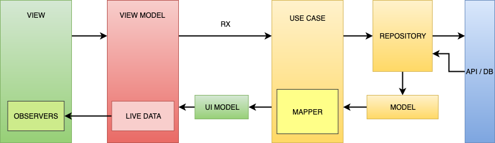
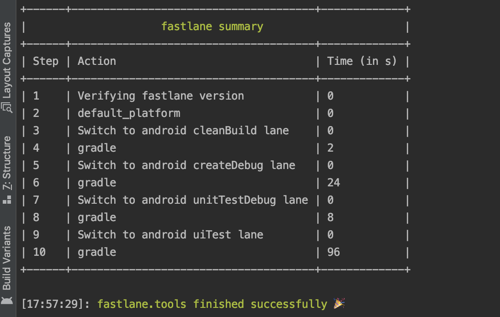
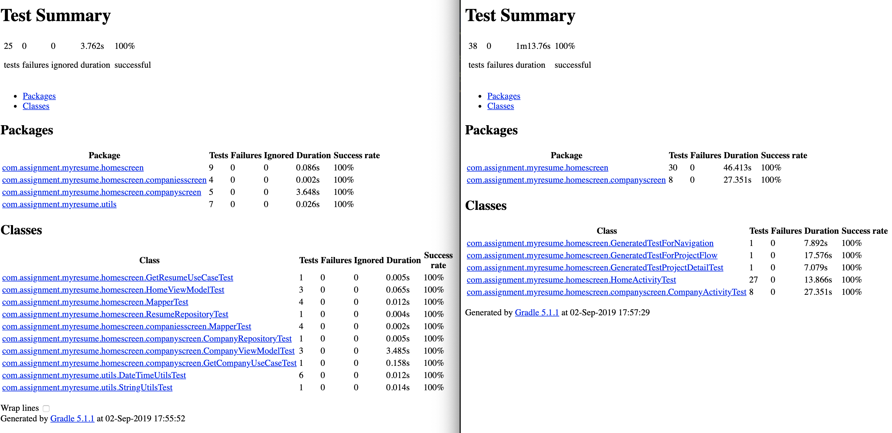

## Introduction
This application contains all my CV details, separated out in three screens (Home, Companies, and Projects).

## Screenshot


## Architecture
The application is designed on MVVM Pattern following the rules of clean architecture.

 


The components of the application are as follows:
- View - Contains Activity and Fragments. No logical operation should be included in it. The purpose of this component is to purely populate the UI and listen to user interactions. 
- ViewModel - Contains all your live data that is being observed in the view. Any change in the live data updates the view. Its acts as a delegate between view and your domain layer which are use-cases.
- UI Models - Contains all the data that is supposed to be populated on View. 
- UseCase - Contains the repository and mapper to make the background call and get the data mapped ready for View.
- Repository - Contains all the service calls for getting the data for the application.
- Api Model - Contains the data classes mapped withe api response.

## Flow of control
 1. In **view** set create **Observers** to listen to the **Livedata** changes on **ViewModel**
 2. **ViewModel** initiate call to **UseCase** using **RX** to fetch data.
 3. **UseCase** having **Repository**, calls the **Service** to get data from api.
 4. Call returns to usecase with **Api Model**.
 5. **UseCase** convertes **Model** to **UiModel** using the **mapper** sitting in it.
 6. **UiModel** is returned to **ViewModel** and **LiveData** is updated.
 7. Updating **LiveData** triggeres the **Observer** sitting in **View**.
 8. DONE!
 
 ## Advantages
 1. Your UI is dumb, does not have any logic.
 3. Since data is stored in LiveData which is lifecycle aware object, recreating the view don't need the data reload.
 4. Because of LiveData and Observer pattern you don't need to worry about the data change coming from back process.
 5. If the view is destroyed during an api call you need not worry about any crash because of UI.
 6. All the heavy lifting and conversion is being done on the UseCase level on the back thread.
 7. The logic or mapping changes are totally unit testable along with usecase, view model and repository.
 8. The amount of code in the view is very less because its divided in different components with smaller code blocks.
 
 ## CI/CD Tools
 ### Fastlane
 
 
 
 - Used fastlane to do all the post development process, like build creating and testing both Unit and UI test cases.
 - The lane for BETA deployment is also included but not using it.
 - Screengrab dependencies are added but since it requires additional permission. I have commented the code out.
 
 ``` fastlane qa ```
 
 The above command will do couple of tasks for you.
 - Clean the project.
 - Create debug build.
 - Run Unit test cases.
 - Run Ui test cases.
 
 ## Test coverage screenshot
  
 
 ## Json data hosted on Gist
   - https://gist.githubusercontent.com/RanaRanvijaySingh/129a3b70d118dfeee857476e7103009a/raw/d7bb676152454d0ac46839902e61a6f72154cc20/resume
   -  https://gist.githubusercontent.com/RanaRanvijaySingh/61c8fd78ac370da3050afa8bab06f688/raw/7edf75b1a9f7a43e2b629079ed8cdcd14b3d73f5/webonise
   -  https://gist.githubusercontent.com/RanaRanvijaySingh/3135f39381f13b2004ea7a215938cd48/raw/51b69f3385e77a7a23767f1848c49afee506269c/theleanapps
   - https://gist.githubusercontent.com/RanaRanvijaySingh/b03778260d79c4f0d9c31776a3b7d3f8/raw/b802f11336617452c9905408f130adc7ab2ade85/globant
